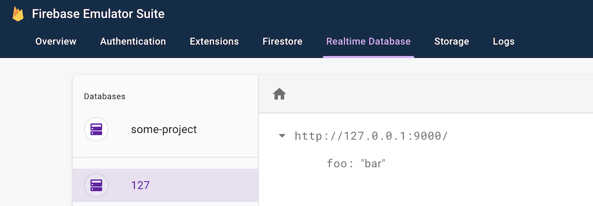

This repo is a minimal reproduction of a `firebase-admin` bug / missing feature: When using the realtime database with `firebase-admin` via the emulator, the database instance name will always be set to `127`.

This is because to use the realtime database via admin in the emulator we have to do...

```
admin.initializeApp({
  databaseURL: "http://127.0.0.1:9000",
});
```

...but the admin app infers the database name to be the first part after the protocol, ergo `127`. This means there is no (easy) way to run a full app with a client layer in the emulator.

To see this in action:

1. Run `npm install`
1. Run `npm run emulator` (leave process running in a terminal window)
1. In a separate terminal, run `npm run demo`, which basically does `admin.database.ref("foo").set("bar")`
1. Visit http://127.0.0.1:4000/database and observer that `foo=bar` was set in DB instance `127`.


